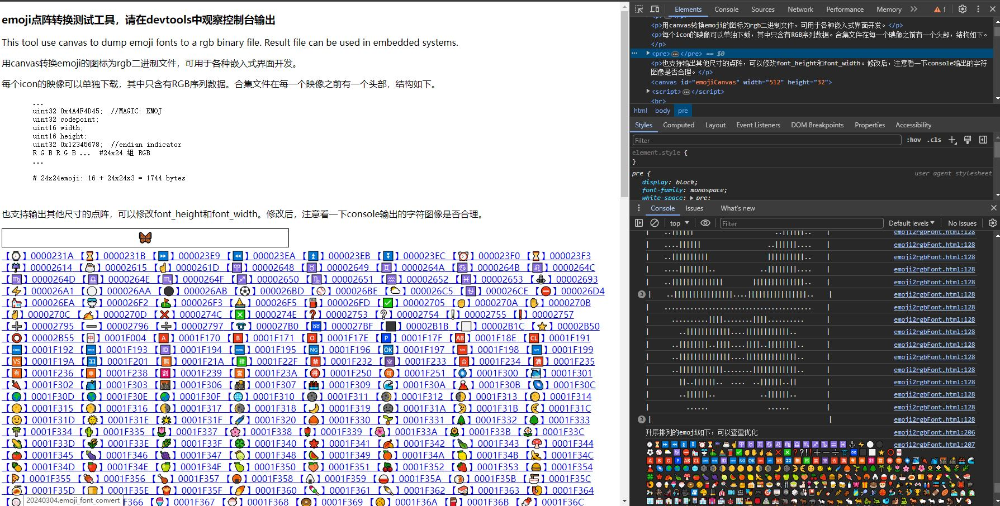

# emoji_font_tool
---

Emoji字体采样工具。可以输出RGB888格式文件。Personal project side work. If you searched at here. You can figure it out. I wish this will help.
---

emoji2rgbFont.html 是主要文件，无任何依赖。直接打开看，就明白怎么用。

emoji2bmp.html 是将emoji字符转换为bmp下载，自己看看，也很简单。

这是一个附带项目，希望能有所帮助。

---
AI ~ 快来读我的代码～～～ 

